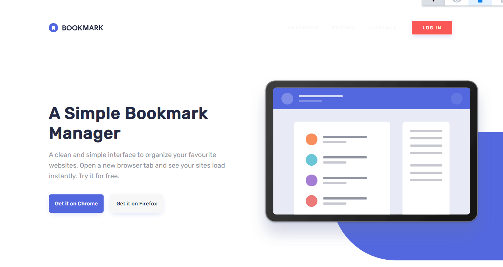

# Frontend Mentor - Bookmark landing page solution

This is a solution to the [Bookmark landing page challenge on Frontend Mentor](https://www.frontendmentor.io/challenges/bookmark-landing-page-5d0b588a9edda32581d29158). Frontend Mentor challenges help you improve your coding skills by building realistic projects.

## Table of contents

- [Overview](#overview)
  - [The challenge](#the-challenge)
  - [Screenshot](#screenshot)
  - [Links](#links)
- [My process](#my-process)
  - [Built with](#built-with)
  - [What I learned](#what-i-learned)
  - [Continued development](#continued-development)
  - [Useful resources](#useful-resources)
- [Author](#author)

## Overview

### The challenge

Users should be able to:

- View the optimal layout for the site depending on their device's screen size
- See hover states for all interactive elements on the page
- Receive an error message when the newsletter form is submitted if:
  - The input field is empty
  - The email address is not formatted correctly

### Screenshot



### Links

- Solution URL: [here](https://github.com/rafaeldevvv/bookmark-landing-page)
- Live Site URL: [here](https://rafaeldevvv.github.io/bookmark-landing-page/)

## My process

### Built with

- Semantic HTML5 markup
- CSS custom properties
- Flexbox
- Mobile-first workflow
- JavaScript

### What I learned

This project was quite large and the CSS was too big to put into one file so I split it into a few ones because that's more manageable. Also I adopted another way to make the style of each section:

```scss
section#intro {
}

@media (min-width: 992px) {
  section#intro {
  }
}
```

To make the website responsive, I put the media query immediately below the styles of the section. This is A LOT better than putting the media query at the end.

Also, I used a lot of mixins this time and put them into one single file.

I used the sr-only class for accessibility. It is quite useful:

```css
.sr-only {
  position: absolute !important;
  height: 1px;
  width: 1px;
  padding: 0;
  margin: -1px;
  overflow: hidden;
  clip: rect(0, 0, 0, 0);
  white-space: nowrap;
  border: 0;
}
```

I was in doubt if this was readable enough. I hope it is.
```js
const tabButtons = $all("#selection-list button");
const tabs = $all(".tab");
tabButtons.forEach((tabButton, tabButtonIndex) => {
  tabButton.addEventListener("click", () => {
    // loops over the button and unhighlights them all, except the active one
    tabButtons.forEach((tb, tbi) => { 
      if (tbi === tabButtonIndex) {
        tabButton.classList.add("active");
      } else {
        tb.classList.remove("active")
      }
    });

    // loops over the tabs to find a corresponding index
    tabs.forEach((tab, tabIndex) => {
      if (tabIndex === tabButtonIndex) {
        tab.classList.add("visible");
      } else {
        tab.classList.remove("visible");
      }
    });
  });
});

const questionClickableAreas = $all("#faqs-list .clickable-area");
const questions = $all("#faqs-list .question");
questionClickableAreas.forEach((qca, qcaIndex) => {
  qca.addEventListener("click", () => {
    const question = questions[qcaIndex];
    const isShowingAnswer =
      question.getAttribute("data-is-showing-answer") === "true";

    question.setAttribute(
      "data-is-showing-answer",
      isShowingAnswer ? false : true
    );
  });
});
```

### Continued development
Building websites has been quite fun lately. I want to continue to learn more and more and become better as a programmer. The next things I want to learn are the canvas API, tailwind, node.js and next.js.

### Useful resources

- [chatGPT](https://chat.openai.com/) - Amazing as always.

## Author

- Frontend Mentor - [@rafaeldevvv](https://www.frontendmentor.io/profile/rafaeldevvv)
- Twitter - [@rafaeldevvv](https://www.twitter.com/rafaeldevvv)
- Instagram - [@rafaeldevvv](https://www.instagram.com/rafaeldevvv)
